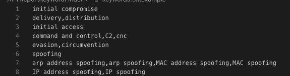
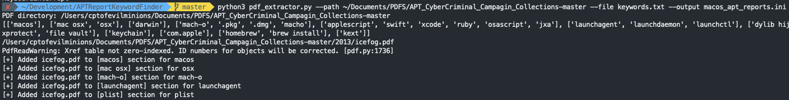
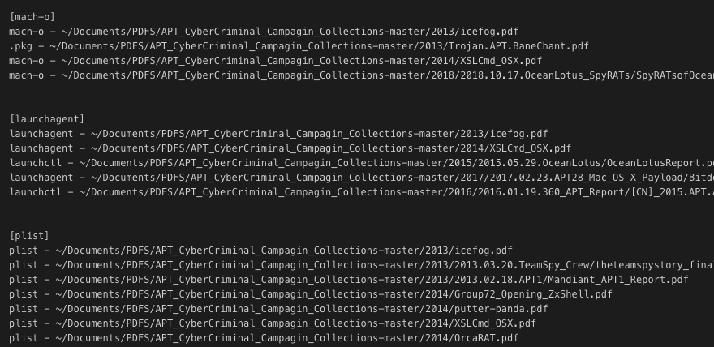

# APT Report Keyword Finder

This Python tool takes in a directory of PDFs and a keyword list to detect the exist of a keyword in a PDF. If a keyword is detected in a PDF the tool will add it too `<outfile>.ini` for later review.

## Obtain APT reports
* [Github - kbandla/APTnotes](https://github.com/kbandla/APTnotes)
* [Github - aptnotes/data](https://github.com/aptnotes/data)
* [Github - CyberMonitor/APT_CyberCriminal_Campagin_Collections](https://github.com/CyberMonitor/APT_CyberCriminal_Campagin_Collections)

## Setup env
1. `cd APTReportKeywordFinder`
1. `virtualenv -p python3 venv`
1. `source venv/bin/activate`
1. `pip3 install -r requirements.txt`

## Create a list of keywords
1. Create a file called `keywords.txt` and add keywords(like below) to search for
    1. `initial compromise`
    1. `delivery`
    1. `lateral movement`
    1. `exfil`
    1. A line can have more than one keyword for a set of keywords that are alike, like line 7
    1. 

## Scan PDFs
1. `python3 pdf_extractor.py --path <path of directory with PDFs> --file <file path to keyword>`
    1. Example: `python3 pdf_extractor.py --path /tmp/APT_CyberCriminal_Campagin_Collections --file keywords.txt --output pdf_files.ini`
        1. Path: `/tmp/APT_CyberCriminal_Campagin_Collections`
        1. file: `keywords.txt`
    1. 
1. An output file of `pdf_files.ini` will be generated with a list of PDFs for each keyword.
    1. 

## Resources/Sources
* [Python, argparse, and command line arguments](https://www.pyimagesearch.com/2018/03/12/python-argparse-command-line-arguments/)
* [Recursive sub folder search and return files in a list python](https://stackoverflow.com/questions/18394147/recursive-sub-folder-search-and-return-files-in-a-list-python)
* [How to Extract Words from PDFs with Python](https://medium.com/@rqaiserr/how-to-convert-pdfs-into-searchable-key-words-with-python-85aab86c544f)
* [Github - kbandla/APTnotes](https://github.com/kbandla/APTnotes)
* [Github - aptnotes/data](https://github.com/aptnotes/data)
* [Github - CyberMonitor/APT_CyberCriminal_Campagin_Collections](https://github.com/CyberMonitor/APT_CyberCriminal_Campagin_Collections)

